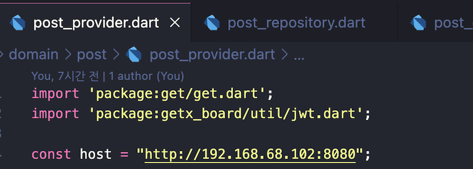

# getx_board

# getx_board

First, Change your host in "post_provider.dart" and "host_provider.dart"

Windows cmd

```cmd
ipconfig
```

Mac terminal

```terminal
ipconfig getifaddr en0
```



Second, start Spring server

```java
java -jar auth-jwt-0.0.1-SNAPSHOT.jar
```


로그인 / 회원가입 페이지


게시판 구현


본인 글에 한에서만 수정 삭제 가능


글 작성 및 삭제


회원 정보

First, post_provider.dart, host_provider.dart change your host

```cmd window - ipconfig
//Windows cmd
ipconfig
```

terminal mac - ipconfig getifaddren0


Second, start Spring server

java -jar auth-jwt-0.0.1-SNAPSHOT.jar


