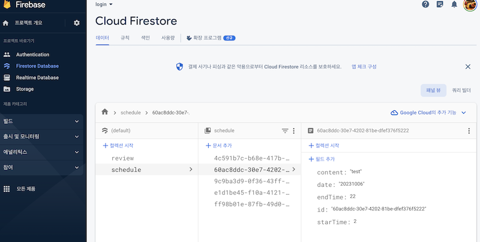

# schedule

스케쥴 앱.

현재 Firebase Firestore로 적용되어 있는데, 버전 오류로 인하여 읽기가 불가능함.

Drift와 Provider를 사용했을 때에는 하루 일정 갯수와 리스트가 하단에 표시됨.

밀어서 삭제 기능도 적용되어 있음.

Node.js를 이용한 서버는 제공받은 것을 사용.

Drift를 이용한 SQL은 로컬에서 진행

Firestore를 이용하면 실제로 등록은 되나 현재 오류로 불러오지를 못하고 있음.
